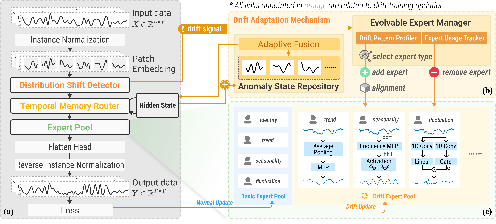

# Dynamic TMoE: Un Marco de Mezcla Dinámica de Expertos Sensible al Desplazamiento para la Predicción de Series Temporales No Estacionarias

<div align="center">

[](https://icml.cc/virtual/2026/poster/64808)
[](https://www.python.org/)
[](https://pytorch.org/)


</div>

Este repositorio contiene la implementación oficial de **Dynamic TMoE**, aceptado como póster en **ICML 2026**.



<p align="center">
  <strong>Arquitectura del marco Dynamic TMoE</strong>
</p>

## 📖 Descripción general

Dynamic TMoE es un marco adaptativo de Mezcla de Expertos (MoE) para la predicción de series temporales no estacionarias. Supera la rigidez de los MoE tradicionales mediante el uso de la Discrepancia Media Máxima (MMD) para detectar cambios en la distribución, expandiendo o podando dinámicamente su grupo heterogéneo de expertos para optimizar la capacidad. Combinado con un enrutador de memoria temporal para una selección de expertos estable y consciente del contexto, Dynamic TMoE logra resultados de vanguardia en nueve conjuntos de referencia, superando a líneas base avanzadas al reducir el MSE y el MAE en un promedio del 10,4% y 7,8%, respectivamente.

## 🚀 Inicio rápido

### Configuración del entorno

Para configurar el entorno, instale Python 3.10 y las dependencias requeridas:

```bash
conda create -n dynamic_tmoe python=3.10
conda activate dynamic_tmoe
pip install -r requirements.txt
```

### Preparación de conjuntos de datos

Coloque los conjuntos de datos de referencia en la carpeta `./dataset` con la siguiente estructura:

```text
dataset/
├── ETT-small/
│   ├── ETTh1.csv
│   ├── ETTh2.csv
│   ├── ETTm1.csv
│   └── ETTm2.csv
├── electricity/
│   └── electricity.csv
├── traffic/
│   └── traffic.csv
├── weather/
│   └── weather.csv
├── exchange_rate/
│   └── exchange_rate.csv
└── illness/
    └── national_illness.csv
```

### Ejecución de experimentos

Ejecute los siguientes scripts para diferentes conjuntos de referencia de pronóstico a largo plazo:

```bash
# eg. ETTh1 benchmarks
bash ./scripts/ETTh1.sh

```

## 📚 Citación

Si considera que este repositorio es útil, por favor cite nuestro artículo:

```bibtex
@inproceedings{
  zhu2026dynamic_tmoe,
  title={Dynamic {TMoE}: A Drift-Aware Dynamic Mixture of Experts Framework for Non-Stationary Time Series Forecasting},
  author={Jiawen Zhu and Shuhan Liu and Di Weng and Yingcai Wu},
  booktitle={Forty-third International Conference on Machine Learning},
  year={2026},
  url={https://openreview.net/forum?id=JabkBcaoa9}
}
```

## 🙏 Agradecimientos
Agradecemos a los siguientes repositorios por su invaluable código y conjuntos de datos:

- [Time-Series-Library](https://github.com/thuml/Time-Series-Library)
